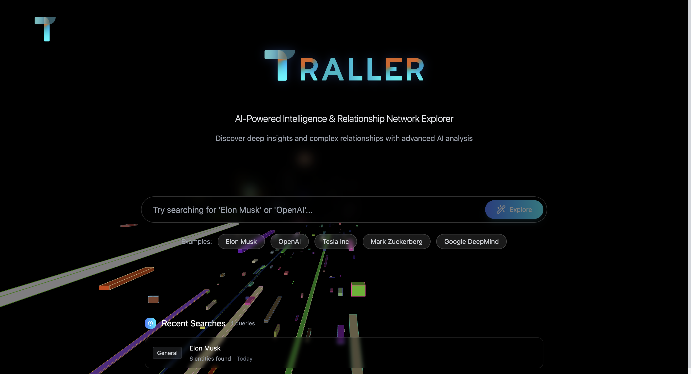

<div align="center">
  
  <p>一个可视化的智能研究代理</p>
</div>

<div align="center">
  
  
  
  
  
</div>

---

## 🚀 项目简介

你是否曾为了解一个人物、一个概念或一个事件，在无数个网页和文档中反复横跳，试图将碎片化的信息拼凑成完整的图像？我曾深陷其中，这正是 **Traller** 诞生的原因。

**Traller** 不仅仅是一个搜索引擎。它是一个智能研究代理，旨在将繁琐的信息搜集和整理工作，变成一次直观、可视化的探索之旅。你只需要输入一个关键词——比如一个人的名字——Traller 就会动用背后强大的语言模型（如 Gemini, Perplexity），为你挖掘相关信息，并自动梳理出核心实体与它们之间的复杂关系，最终以一张动态知识图谱清晰地呈现在你面前。

这个项目源于一个简单的想法：让获取知识的过程本身，也充满探索的乐趣。

### ✨ 核心功能

- **多AI引擎驱动**: 集成 `Kimi K2`, `Perplexity`, `Tavily` 等多种AI服务，从不同维度搜集和分析信息。
- **关系图谱可视化**: 自动提取关键实体（人物、组织、地点等），生成可交互的关系网络。
- **动态探索界面**: 基于 `React` 和 `p5.js`，提供富有生命力的可视化效果和流畅的交互体验。
- **稳定可扩展后端**: 基于 `NestJS` 构建，确保服务的高效与可靠。

## ⚠️ 潜在风险与道德考量

我们深知，信息聚合工具在带来便利的同时，也可能被滥用，甚至触及“人肉搜索”（开盒）的道德和法律红线。Traller 的设计初衷是提高 **公开信息** 的获取和整合效率，而非侵犯个人隐私。

因此，本项目在开发和未来迭代中，将严格遵守以下原则：

1.  **数据来源合法性**: Traller 只聚合和处理来自 **公开渠道**（如新闻网站、百科、公共数据库等）的信息。我们不会、也绝不会尝试获取任何非公开的个人数据。
2.  **目的限定性**: 项目的目的是辅助研究和学习，帮助用户理解事物之间的关联， **绝非** 提供用于骚扰、攻击他人的工具。
3.  **合规路线图**: 我们正在积极探索技术和产品层面的限制措施，例如通过算法识别并 **脱敏处理** 部分个人敏感信息，并对特定类型的查询加以限制。

我们致力于将 Traller 打造成一个负责任的、向善的工具，并欢迎社区就此提出建议，共同探讨技术的边界与未来。

## 🛠️ 技术栈

- **后端**: [NestJS](https://nestjs.com/), [TypeScript](https://www.typescriptlang.org/)
- **前端**: [React](https://react.dev/), [Vite](https://vitejs.dev/), [TypeScript](https://www.typescriptlang.org/), [Tailwind CSS](https://tailwindcss.com/), [p5.js](https://p5js.org/)
- **包管理器**: [pnpm](https://pnpm.io/)

## ⚡ 快速开始 (本地运行)

请确保您的开发环境中已安装 [Node.js](https://nodejs.org/) (v18 或更高版本) 和 [pnpm](https://pnpm.io/)。

### 1. 克隆仓库

```bash
git clone https://github.com/your-username/Traller.git
cd Traller
```

### 2. 安装与启动

项目根目录下的 `start.sh` 脚本会自动处理所有依赖安装和服务启动。只需执行：

```bash
chmod +x ./start.sh
./start.sh
```

脚本将分别安装前端和后端的依赖，并以开发模式启动两个服务。

### 3. 访问项目

启动成功后，您可以通过以下地址访问：

- **🖥️ 前端应用**: `http://localhost:5173`
- **⚙️ 后端服务**: `http://localhost:3000`

## 📸 项目截图



## 🤝 贡献指南

我们非常欢迎来自社区的贡献！如果您有任何好的想法或发现了 Bug，请随时通过以下方式参与：

- **提交 Issue**: 报告 Bug 或提出功能建议。
- **提交 Pull Request**: 改进代码、添加新功能或修复问题。

我们期待您的参与！

## 📄 许可证

本项目基于 MIT License 开源。
