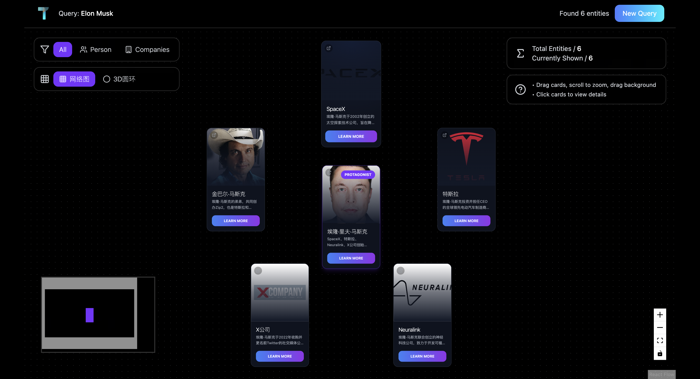

<div align="center">
  <!-- Increase the logo image size for better visibility -->
  
  <p>从一句话，查清一个人</p>
</div>

<div align="center">
  
  
  
  
  
</div>

---

## 项目简介

你是否曾为了解一个人——他是谁、他做过什么、他在哪些地方留下过痕迹——而在无数网页、平台与社交账号之间反复横跳？
碎片信息太多，可信信息太少。而你，只想要一个清晰的答案。

这正是 Traller 诞生的原因。

Traller 是一个专注于「人物搜索与画像」的 AI 智能体。它不是传统意义上的搜索引擎，而是你的网络情报代理。你只需输入一句话、一个名字，甚至一个模糊的描述，Traller 会自动联动背后的语言模型与多源数据，追踪该人物在互联网上的数字足迹，提取核心事件与关联实体，最终生成一张清晰、可交互的知识图谱。

## 项目截图

<!-- Arrange the two images side by side for better layout -->
<p align="center">
  
  
</p>

## 视频介绍

<p align="center">
  <!-- Add a GIF introduction for better demonstration -->
  
</p>


### 核心功能

- **多AI引擎驱动**: 集成 `Kimi K2`, `Perplexity`, `Tavily` 等多种AI服务，从不同维度搜集和分析信息。
- **关系图谱可视化**: 自动提取关键实体（人物、组织、地点等），生成可交互的关系网络。
- **动态探索界面**: 基于 `React` 和 `p5.js`，提供富有生命力的可视化效果和流畅的交互体验。
- **稳定可扩展后端**: 基于 `NestJS` 构建，确保服务的高效与可靠。

## 技术栈

- **后端**: [NestJS](https://nestjs.com/), [TypeScript](https://www.typescriptlang.org/)
- **前端**: [React](https://react.dev/), [Vite](https://vitejs.dev/), [TypeScript](https://www.typescriptlang.org/), [Tailwind CSS](https://tailwindcss.com/), [p5.js](https://p5js.org/)
- **包管理器**: [pnpm](https://pnpm.io/)

## 快速开始 (本地运行)

请确保您的开发环境中已安装 [Node.js](https://nodejs.org/) (v18 或更高版本) 和 [pnpm](https://pnpm.io/)。

### 1. 克隆仓库

```bash
git clone https://github.com/your-username/Traller.git
cd Traller
```

### 2. 安装与启动

项目根目录下的 `start.sh` 脚本会自动处理所有依赖安装和服务启动。只需执行：

```bash
chmod +x ./start.sh
./start.sh
```

脚本将分别安装前端和后端的依赖，并以开发模式启动两个服务。

### 3. 访问项目

启动成功后，您可以通过以下地址访问：

- **🖥️ 前端应用**: `http://localhost:5173`
- **⚙️ 后端服务**: `http://localhost:3000`

## 📄 许可证

本项目基于 MIT License 开源。
